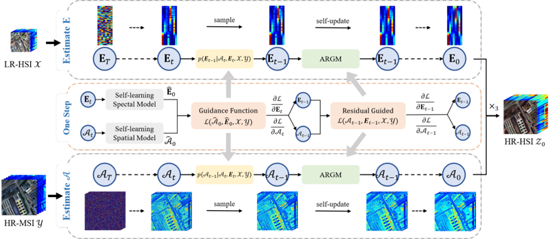

# [CVPR 2025] ARGS-Diff-train

<a href="https://arxiv.org/abs/2505.11800"></a>

> **Self-Learning Hyperspectral and Multispectral Image Fusion via Adaptive Residual Guided Subspace Diffusion Model**
>
> Jian Zhu, [He Wang](https://scholar.google.com.hk/citations?user=J5bNDdYAAAAJ), [Yang Xu](https://scholar.google.com.hk/citations?user=c8j941EAAAAJ), [Zebin Wu](https://scholar.google.com.hk/citations?user=y_FtCsYAAAAJ), and Zhihui Wei
>
> Nanjing University of Science and Technology

## Framework



## Requirements 

1. Environment setup

```shell
conda create -n args python=3.9
conda activate args
```

2. Requirements installation

```shell
pip install -r requirements.txt
```

## Quick Start (using the Pavia dataset as an example)

#### Train spatial networks

```bash
python spatial_train.py
```

#### Train spectral networks

```bash
python spectral_train.py
```

## Train on Your Own Data

#### Train the Spatial Network

1. Place the `x.mat` file into the `datasets` folder. This file should contain the keys: `LR-HSI`, `HR-MSI`, and optionally `HR-HSI`.

2. Modify lines 67 and 68 in `spatial_train.py` accordingly. For example:

   ```python
   data_idx = 4
   type_list = ['pavia', 'chikusei', 'ksc', 'houston', 'x']
   ```

3. Run:

   ```bash
   python spatial_train.py
   ```

#### Train the Spectral Network

1. Ensure that `x.mat` is placed in the `datasets` folder.

2. Modify lines 66, 67, and 68 in `spectral_train.py` as follows:

   ```python
   data_idx = 4
   type_list = ['pavia', 'chikusei', 'ksc', 'houston', 'x']
   step_list = [500000, 600000, 800000, 400000, step]  # e.g., if this is the 'wdc' dataset with 191 spectral bands, here can be step=900000
   ```

3. In `script_util.py`, after line 169, set the corresponding spectral network architecture. For example:

   ```python
   elif data_type == 'wdc':
       model = FCN(191, 191, [400, 800, 400], 100, num_embeddings=diffusion_steps)
   ```

   There are no strict requirements here — approximate configurations are fine. Feel free to experiment.

4. Run:

   ```bash
   python spectral_train.py
   ```

## Acknowledge

Some of the codes are built upon [guided-diffusion](https://github.com/openai/guided-diffusion).
